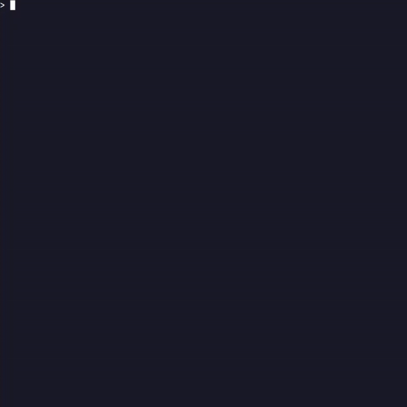

# hello-world

I'm Michael, a nerd / geek / whatever with a few skills here and there all around computing and software development

I somehow still love everything about computers, practical mathematics, and engineering in general

My repositories keep getting more diverse and there is always something new I am working on, so enjoy the show

[Check out my personal website!](https://michaeljagiello.micjagger.net/)

    

